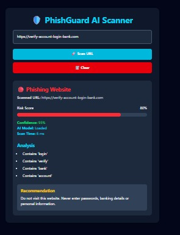
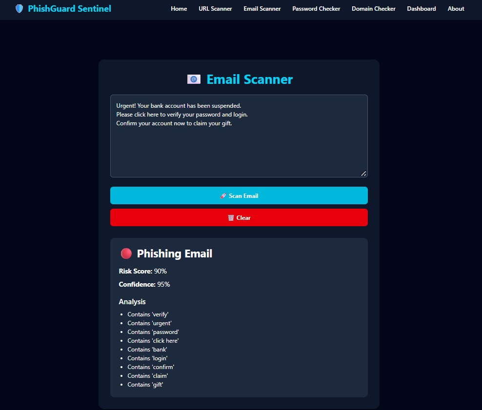
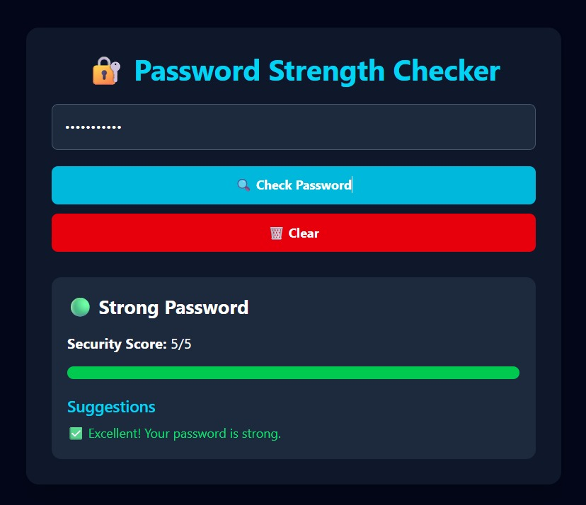
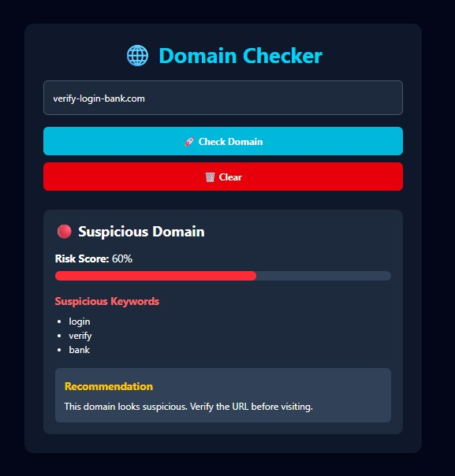

# 🛡️ PhishGuard Sentinel

> An AI-powered cybersecurity web application for detecting phishing URLs, suspicious emails, weak passwords, and risky domains.

## 📌 Project Overview

PhishGuard Sentinel is a cybersecurity web application designed to help users identify common phishing and security threats.

The application combines:

- 🤖 Machine Learning
- 🔍 Rule-Based Detection
- 📊 Risk Scoring
- 📈 Security Dashboard
- 💾 SQLite Scan History

Users can scan URLs, emails, passwords, and domains through a simple web interface.

## 📸 Screenshots

### 🔗 URL Scanner



### 📧 Email Scanner



### 🔐 Password Checker



### 🌐 Domain Checker


---

## ✨ Features

### 🔗 URL Scanner

Analyzes URLs using a trained Machine Learning model along with suspicious keyword detection.

Provides:

- Phishing/Safe prediction
- Risk score
- Confidence score
- Security analysis
- Recommendation
- Scan time

### 📧 Email Scanner

Checks email content for common phishing indicators such as:

- Urgent messages
- Password requests
- Banking references
- Login requests
- Suspicious links
- Account verification requests
- Prize/gift scams

### 🔐 Password Checker

Checks password strength using:

- Password length
- Uppercase letters
- Lowercase letters
- Numbers
- Special characters

Classifies passwords as:

- 🔴 Weak
- 🟡 Medium
- 🟢 Strong

### 🌐 Domain Checker

Checks domains for suspicious security-related keywords.

Provides:

- Domain status
- Risk score
- Suspicious keywords
- Security recommendation

### 📊 Security Dashboard

Displays:

- Total scans
- Safe scans
- Phishing scans
- Suspicious scans
- Scan statistics chart
- Complete scan history

### 💾 Permanent Scan History

Scan results are stored in an SQLite database so that scan history remains available even after restarting the backend.

---

## 🧠 Detection Methods

PhishGuard Sentinel uses two main detection approaches.

### 1. Machine Learning

The URL Scanner uses a trained Machine Learning model to classify URLs.

The application extracts URL-based features and sends them to the trained model for prediction.

### 2. Rule-Based Detection

Email, password, and domain checks use security rules and predefined indicators.

This combination provides a simple but practical cybersecurity detection system.

---

## 🏗️ System Architecture

```text
                    ┌──────────────────────┐
                    │      User            │
                    └──────────┬───────────┘
                               │
                               ▼
                    ┌──────────────────────┐
                    │ React Frontend       │
                    │ TypeScript + Tailwind│
                    └──────────┬───────────┘
                               │
                         HTTP Requests
                               │
                               ▼
                    ┌──────────────────────┐
                    │ Flask Backend        │
                    │ Python + Flask-CORS  │
                    └──────────┬───────────┘
                               │
                 ┌─────────────┼─────────────┐
                 ▼             ▼             ▼
          ┌────────────┐ ┌────────────┐ ┌────────────┐
          │ ML Model   │ │ Rule-Based │ │ SQLite DB  │
          │ URL Scan   │ │ Detection  │ │ Scan History│
          └────────────┘ └────────────┘ └────────────┘
```

---

## 🛠️ Technologies Used

### Frontend

- React
- TypeScript
- Vite
- Tailwind CSS
- React Router
- Chart.js
- react-chartjs-2

### Backend

- Python
- Flask
- Flask-CORS
- Scikit-learn
- Joblib
- SQLite

### Development Tools

- Visual Studio Code
- Git
- GitHub

---

## 📂 Project Structure

```text
phishguard/
│
├── backend/
│   ├── app.py
│   ├── model.pkl
│   └── phishguard.db
│
├── src/
│   ├── components/
│   ├── pages/
│   ├── App.tsx
│   └── main.tsx
│
├── public/
├── README.md
├── package.json
├── package-lock.json
└── vite.config.ts
```

---

## 🚀 How to Run the Project

### 1. Clone the Repository

```bash
git clone https://github.com/sridevibonam/phishguard.git
```

```bash
cd phishguard
```

### 2. Install Frontend Dependencies

```bash
npm install
```

### 3. Start the Frontend

```bash
npm run dev
```

Frontend:

```text
http://localhost:5173
```

---

## 🐍 Backend Setup

Open another terminal.

Go to the backend:

```powershell
cd backend
```

Activate the Python virtual environment:

```powershell
..\venv\Scripts\Activate.ps1
```

Start Flask:

```powershell
python app.py
```

Backend:

```text
http://127.0.0.1:5000
```

---

## 🧪 Example Test Cases

### Safe URL

```text
https://google.com
```

Expected:

```text
Safe Website
Risk Score: 12%
Confidence: 94%
```

### Phishing URL

```text
https://verify-account-login-bank.com
```

Expected:

```text
Phishing Website
Risk Score: 80%
Confidence: 95%
```

### Phishing Email

```text
Urgent! Your bank account has been suspended.
Please click here to verify your password and login.
Confirm your account now to claim your gift.
```

Expected:

```text
Phishing Email
Risk Score: 90%
Confidence: 95%
```

### Weak Password

```text
abc
```

Expected:

```text
Weak Password
Security Score: 1/5
```

### Strong Password

```text
Sridevi@123
```

Expected:

```text
Strong Password
Security Score: 5/5
```

### Suspicious Domain

```text
verify-login-bank.com
```

Expected:

```text
Suspicious Domain
Risk Score: 60%
```

### Safe Domain

```text
google.com
```

Expected:

```text
Safe Domain
Risk Score: 0%
```

---

## 📊 Dashboard

The dashboard provides an overview of security scans performed by the application.

It displays:

- Total Scans
- Safe Scans
- Phishing Scans
- Suspicious Scans
- Scan Statistics
- Scan History

Scan results are stored permanently using SQLite.

---

## 🔒 Security Features

PhishGuard Sentinel helps users identify suspicious security indicators before interacting with potentially unsafe content.

The application provides:

- Risk-based results
- Confidence scores
- Suspicious keyword detection
- Security recommendations
- Password strength analysis
- Scan history

> **Note:** PhishGuard Sentinel is an educational cybersecurity project. Detection results should not be treated as a guarantee that a website or email is completely safe.

---

## 🔮 Future Enhancements

Possible future improvements include:

- Real-time URL reputation checking
- WHOIS domain information
- SSL certificate analysis
- VirusTotal integration
- Improved Machine Learning model
- User authentication
- Advanced analytics
- Email attachment scanning
- Threat intelligence integration
- Cloud deployment

---

## 🎯 Project Goal

The main goal of PhishGuard Sentinel is to create an easy-to-use cybersecurity tool that helps users understand and identify common phishing and security threats.

The project also demonstrates practical experience with:

- Full-stack web development
- Python backend development
- Machine Learning
- Cybersecurity concepts
- REST APIs
- Database integration
- React development

---

## 👩‍💻 Author

**Bonam Sridevi**

B.Tech Computer Science Engineering

GitHub:  
https://github.com/sridevibonam

---

## ⭐ Project Highlights

- 🤖 Machine Learning based URL detection
- 🔍 Rule-based phishing detection
- 📊 Interactive security dashboard
- 💾 SQLite persistent scan history
- ⚡ React + Flask full-stack architecture
- 🔐 Password security analysis
- 🌐 Domain security checking

---

⭐ If you find this project useful, consider giving the repository a star!